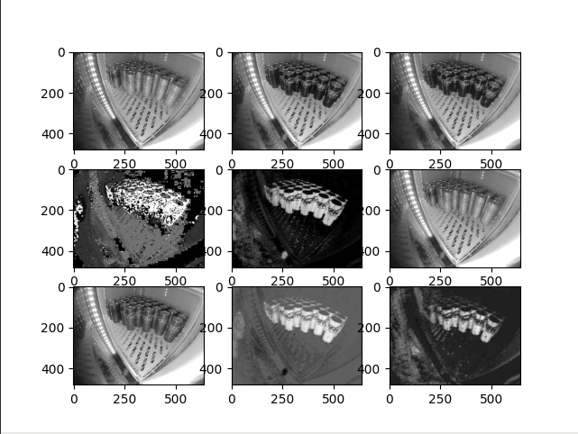
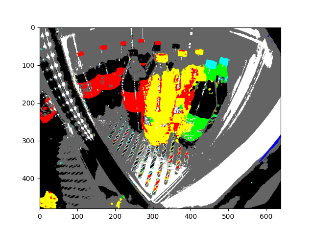
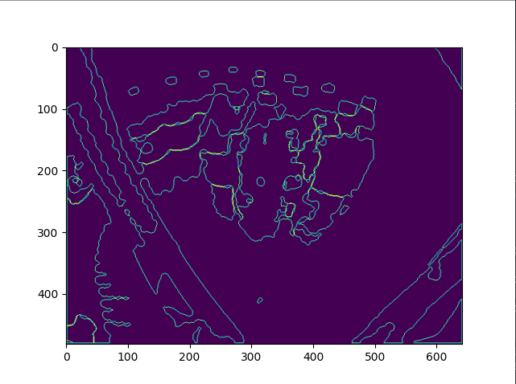
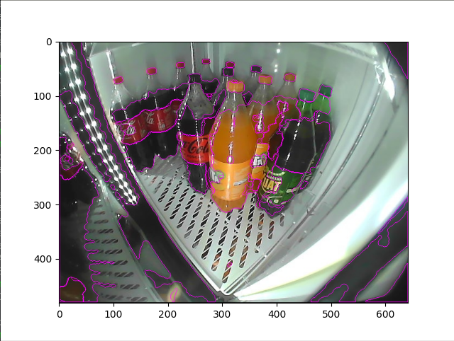
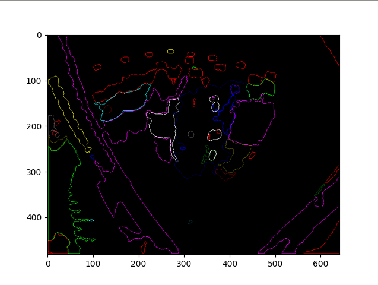

# processamento de magens
Um trabalho final da disciplina SCC0251 - Processamento de Imagens.


Nossa primeira experiência foi analisar a imagem diferentes modelos de cor para analisar qual seria mais produtivo de trabalhar.<br/>

```
python3 teste1.py shelf_images/12_2.jpg
``` 


Notamos que o ideal para separar os objetos do fundo é a saturação e para para separar os diferentes objetos entre si o hue.
Conseguimos produzir esssa imagem com menos cores para tentar simplificar o modelo.

```
python3 teste8.py shelf_images/18_3.jpg
``` 


A partir de cada cor geramos uma máscara, e processamos as máscaras para ter uma sequência de pixels representando as bordas da máscara.
A imagem seguinte mostra as bordas, e sobreposição das bordas sobre a imagem.

```
python3 teste12.py shelf_images/18_3.jpg
``` 



Pegamos o angulo da tangente em cada ponto dessas curvas e a subdividimos em 20 pedaços, comparamos esses 20 valores entre si para tentar achar formas parecidas.
Esse foi o resultado:

```
python3 teste10.py shelf_images/18_3.jpg
``` 


Acreditamos que esse método pode vir a ser suficiente para reconhecer as tampinhas das garrafa.
